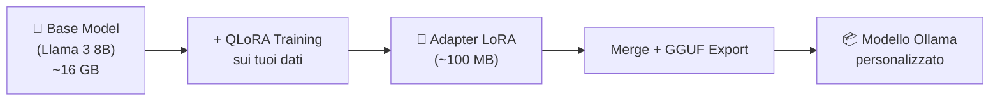
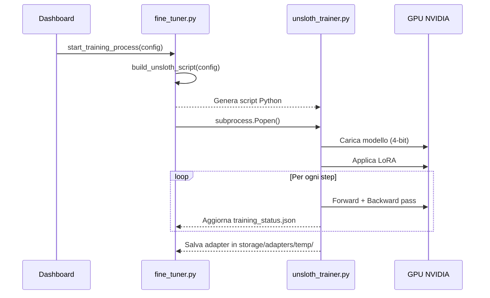
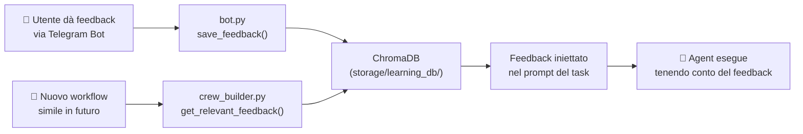

# 📚 Lezione: Local Model Training in Alfredo

## Indice
1. [Cos'è il Fine-Tuning e perché serve](#1-cosè-il-fine-tuning-e-perché-serve)
2. [Architettura del sistema](#2-architettura-del-sistema)
3. [Prerequisiti](#3-prerequisiti)
4. [Guida passo-passo: le 5 Tab](#4-guida-passo-passo-le-5-tab)
5. [Il sistema Learning Memory](#5-il-sistema-learning-memory-separato)
6. [Formati Dataset supportati](#6-formati-dataset-supportati)
7. [Struttura dei file nel progetto](#7-struttura-dei-file-nel-progetto)
8. [FAQ e Troubleshooting](#8-faq-e-troubleshooting)

---

## 1. Cos'è il Fine-Tuning e perché serve

### Il problema
I modelli LLM (come Llama, Mistral, Qwen) sono addestrati su dati generici. Sanno parlare di tutto, ma **non sanno nulla del tuo dominio specifico** (es. la tua azienda, i tuoi prodotti, il tuo gergo tecnico).

### La soluzione: Fine-Tuning
Il fine-tuning prende un modello pre-addestrato e **lo specializza** sui tuoi dati. È come prendere un neolaureato brillante e formarlo con i manuali della tua azienda.

### Concetti chiave

| Concetto | Spiegazione |
|---|---|
| **Base Model** | Il modello pre-addestrato di partenza (es. Llama 3 8B). Pesa diversi GB. |
| **LoRA** (Low-Rank Adaptation) | Tecnica che addestra solo una piccola "patch" del modello (~1-2% dei parametri), invece di tutto il modello. Veloce e leggero. |
| **QLoRA** | LoRA + Quantizzazione a 4-bit. Riduce la VRAM necessaria a ~7 GB invece di ~32 GB. È quello che usa Alfredo. |
| **Adapter** | Il file risultante dal training LoRA. È piccolo (~50-100 MB) e si "appoggia" sopra al modello base. |
| **ChatML** | Il formato standard per i dati di addestramento: lista di messaggi con ruoli (system, user, assistant). |
| **GGUF** | Formato per eseguire modelli su CPU/GPU con Ollama. È il formato di export finale. |

### Come funziona visivamente



> [!TIP]
> **Analogia**: Pensa al base model come a un cervello generico. L'adapter LoRA è come un "post-it" con istruzioni specifiche appiccicato sopra. Il cervello originale non cambia, ma ora sa rispondere nel modo che vuoi tu.

---

## 2. Architettura del sistema

Alfredo ha **due sistemi di apprendimento completamente separati**:

```mermaid
graph TD
    subgraph "🔧 Fine-Tuning (Modifica il modello)"
        FT["core/fine_tuner.py"]
        FT --> SCRIPT["storage/scripts/unsloth_trainer.py<br/>(generato a runtime)"]
        SCRIPT --> ADAPTER["storage/adapters/temp/<br/>(LoRA adapter)"]
        ADAPTER --> GGUF["storage/models/{nome}/<br/>(file GGUF per Ollama)"]
    end

    subgraph "🧠 Learning Memory (NON modifica il modello)"
        LM["core/learning_memory.py"]
        LM --> CHROMA["storage/learning_db/<br/>(ChromaDB)"]
        CHROMA --> INJECT["Feedback iniettato<br/>nei prompt dei task"]
    end

    subgraph "🖥️ Dashboard (Streamlit)"
        UI["ui/dashboard.py<br/>render_local_training()"]
        UI --> FT
    end

    subgraph "🤖 Bot Telegram"
        BOT["bot.py"]
        BOT --> LM
    end

    style FT fill:#2d5016,stroke:#4ade80
    style LM fill:#1e3a5f,stroke:#60a5fa
```



> [!IMPORTANT]
> **Fine-Tuning** = Modifica permanente del modello con nuovi pesi neurali.
> **Learning Memory** = Sistema RAG che aggiunge feedback passati ai prompt, senza toccare il modello.

---

## 3. Prerequisiti

### Hardware

| Requisito | Minimo | Consigliato |
|---|---|---|
| **GPU** | NVIDIA con 8 GB VRAM | NVIDIA con 16+ GB VRAM |
| **RAM** | 16 GB | 32 GB |
| **Disco** | 20 GB liberi | 50 GB liberi |
| **CUDA** | 11.8+ | 12.1+ |

> [!WARNING]
> **Senza una GPU NVIDIA con CUDA, il training NON funzionerà.** L'inference (tab 4) può funzionare su CPU come fallback, ma sarà lentissima.

### Software

Installa le dipendenze di training separatamente (sono pesanti):

```bash
pip install unsloth torch trl peft bitsandbytes accelerate datasets transformers
```

> [!NOTE]
> Queste dipendenze **non sono incluse** nel `requirements.txt` principale perché richiedono una GPU compatibile. Sono documentate come commento nel file [requirements.txt](file:///c:/Users/pietr/OneDrive/Documenti/GitHub/Alfredo/requirements.txt#L39-L43).

### Variabili ambiente (opzionali)

Per modelli gated (es. Llama 3), aggiungi al file `.env`:

```env
HUGGINGFACE_TOKEN="hf_tuo_token_qui"
```

Puoi ottenere il token su: https://huggingface.co/settings/tokens

---

## 4. Guida passo-passo: le 5 Tab

La dashboard si raggiunge dalla barra laterale di Streamlit: **🪖 Local Model Training**.

### Tab 1: Data Prep 🗃️

**Scopo**: Preparare i dati di training in formato ChatML.

**Come usarla**:
1. Clicca su **"Upload raw files"** e carica i tuoi file (CSV, TXT, JSON, JSONL)
2. Clicca **"Generate ChatML Dataset with AI"**
3. I file vengono:
   - Salvati in `storage/datasets/raw/`
   - Convertiti in `storage/datasets/train_dataset.jsonl` (formato ChatML)

**Formato del dataset generato** (ChatML JSONL):
```json
{"messages": [
  {"role": "system", "content": "You are a helpful AI assistant."},
  {"role": "user", "content": "La tua domanda"},
  {"role": "assistant", "content": "La risposta attesa"}
]}
```

> [!TIP]
> **Regola d'oro**: Più dati di qualità = modello migliore. Punta a **100-500 coppie domanda/risposta** per un buon fine-tuning. Sotto le 50 rischi overfitting.

---

### Tab 2: Fine-Tuning ⚙️

**Scopo**: Configurare e avviare l'addestramento.

**Opzioni**:

| Parametro | Descrizione |
|---|---|
| **Base Model** | Il modello di partenza. Llama 3 8B è il default consigliato. |
| **Training Preset** | Quanto allenare il modello: |

| Preset | Steps | Durata | Quando usarlo |
|---|---|---|---|
| 🚀 Fast | 60 | ~15 min | Test rapido per verificare che i dati funzionino |
| ⚖️ Balanced | 120 | ~45 min | Uso standard, buon rapporto qualità/tempo |
| 🧠 Deep | 300 | ~2h | Produzione, massima qualità |

**Hardware Estimation**: Il pannello a destra mostra quanta VRAM serve e se il tuo sistema è sufficiente.

**Avvio**: Clicca **"Avvia Addestramento 🚀"** per lanciare il processo in background.

> [!NOTE]
> Il training gira come **sottoprocesso Python separato**. Non blocca la dashboard. Lo script viene generato in `storage/scripts/unsloth_trainer.py`.

**Cosa succede sotto il cofano**:


---

### Tab 3: Monitoring & Eval 📊

**Scopo**: Monitorare il training in tempo reale.

**Cosa mostra**:
- **Progress bar**: Step corrente / Step totali + Loss attuale
- **Grafico Loss**: Curva di apprendimento (se i dati reali sono disponibili)
- **Training Logs**: Log del processo (in fase di sviluppo)

**Come leggere la Loss**:
- Loss **alta** (> 2.0) = il modello non ha ancora imparato
- Loss **che scende** = sta imparando ✅
- Loss **che si stabilizza** (~0.5-1.0) = ha convergito ✅
- Loss **che scende a 0** = overfitting ⚠️ (troppo poco dati, troppi step)

---

### Tab 4: Inference Test 💬

**Scopo**: Testare il modello fine-tuned prima di esportarlo.

**Come usarla**:
1. Scrivi un messaggio nella chat
2. Il modello carica l'adapter da `storage/adapters/temp/`
3. Genera una risposta basata sull'addestramento

> [!WARNING]
> Il modello verrà caricato **ogni volta** che invii un messaggio (è un proof-of-concept). In produzione, il modello andrebbe tenuto in memoria.

---

### Tab 5: Export & Deployment 📦

**Scopo**: Esportare il modello per uso in produzione con Ollama.

**Come usarla**:
1. Inserisci un nome per il modello (es. `Alfredo-Support-Bot-8B`)
2. Clicca **"Export to .gguf and Deploy 📦"**
3. Il modello viene:
   - Convertito in formato GGUF (q4_k_m quantization)
   - Salvato in `storage/models/{nome}/`

**Dopo l'export**, puoi caricare il modello in Ollama con:
```bash
ollama create alfredo-support-bot -f storage/models/Alfredo-Support-Bot-8B/Modelfile
```

---

## 5. Il sistema Learning Memory (separato)

> [!IMPORTANT]
> La Learning Memory **NON è fine-tuning**. È un sistema RAG (Retrieval-Augmented Generation) che ricorda il feedback dell'utente e lo inietta nei prompt futuri.

### Come funziona



### Dove viene usata

| File | Cosa fa |
|---|---|
| [bot.py](file:///c:/Users/pietr/OneDrive/Documenti/GitHub/Alfredo/bot.py#L1347-L1368) | Salva il feedback dell'utente ricevuto via Telegram |
| [crew_builder.py](file:///c:/Users/pietr/OneDrive/Documenti/GitHub/Alfredo/core/crew_builder.py#L605-L614) | Cerca feedback simili e li inietta nei task description |
| [learning_memory.py](file:///c:/Users/pietr/OneDrive/Documenti/GitHub/Alfredo/core/learning_memory.py) | Il manager del vector store ChromaDB |

### Differenza chiave

| | Fine-Tuning | Learning Memory |
|---|---|---|
| **Cosa modifica** | I pesi del modello neurale | Solo i prompt (input) |
| **Persistenza** | Permanente (nuovo modello) | Recuperabile per query simili |
| **Richiede GPU** | ✅ Sì, NVIDIA con CUDA | ❌ No |
| **Richiede training** | ✅ Sì, minuti/ore | ❌ No, istantaneo |
| **Dove agisce** | Sul modello locale | Su tutti i modelli (anche cloud) |

---

## 6. Formati Dataset supportati

### CSV (consigliato per dati strutturati)

Il file CSV deve avere almeno due colonne:

| Colonna Prompt (una di queste) | Colonna Risposta (una di queste) |
|---|---|
| `prompt` | `completion` |
| `instruction` | `response` |
| | `output` |

**Esempio** (`training_data.csv`):
```csv
prompt,completion
"Qual è la temperatura di fusione dell'acciaio?","La temperatura di fusione dell'acciaio varia tra 1370°C e 1530°C a seconda della composizione."
"Come si calcola il modulo di Young?","Il modulo di Young E = σ/ε dove σ è lo stress e ε la deformazione."
```

### TXT (formato più semplice)

Le righe vengono lette a coppie: riga dispari = domanda utente, riga pari = risposta assistente.

**Esempio** (`pairs.txt`):
```
Cos'è la conducibilità termica?
La conducibilità termica è la capacità di un materiale di condurre calore, misurata in W/(m·K).
Qual è il punto di ebollizione dell'acqua?
Il punto di ebollizione dell'acqua a pressione atmosferica è 100°C (373.15 K).
```

### JSON / JSONL (formato nativo ChatML)

**JSONL** — un oggetto JSON per riga:
```jsonl
{"messages": [{"role": "user", "content": "Domanda 1"}, {"role": "assistant", "content": "Risposta 1"}]}
{"messages": [{"role": "user", "content": "Domanda 2"}, {"role": "assistant", "content": "Risposta 2"}]}
```

**JSON** — array di oggetti:
```json
[
  {"messages": [{"role": "user", "content": "Domanda 1"}, {"role": "assistant", "content": "Risposta 1"}]},
  {"messages": [{"role": "user", "content": "Domanda 2"}, {"role": "assistant", "content": "Risposta 2"}]}
]
```

---

## 7. Struttura dei file nel progetto

```
Alfredo/
├── core/
│   ├── fine_tuner.py          ← 🔧 Backend: genera script, avvia training, inference, export
│   └── learning_memory.py     ← 🧠 Memoria persistente feedback (ChromaDB)
├── ui/
│   └── dashboard.py           ← 🖥️ UI Streamlit (funzione render_local_training)
├── config/
│   └── training_config.json   ← ⚙️ Configurazione iperparametri e modelli
├── storage/
│   ├── datasets/
│   │   ├── raw/               ← File uploadati originali
│   │   └── train_dataset.jsonl← Dataset in formato ChatML
│   ├── scripts/
│   │   └── unsloth_trainer.py ← Script di training (generato a runtime)
│   ├── adapters/
│   │   └── temp/              ← Adapter LoRA risultante
│   ├── models/
│   │   └── {nome}/            ← Modelli GGUF esportati
│   ├── training_status.json   ← Stato corrente del training
│   └── learning_db/           ← ChromaDB per learning memory
├── .env.example               ← Template variabili ambiente (con HUGGINGFACE_TOKEN)
└── requirements.txt           ← Dipendenze (training deps commentate)
```

---

## 8. FAQ e Troubleshooting

### ❓ "CUDA out of memory"
**Causa**: La GPU non ha abbastanza VRAM.
**Soluzioni**:
1. Usa un modello più piccolo (7B invece di 14B)
2. Riduci il `batch_size` nel config
3. Chiudi altre applicazioni che usano la GPU

### ❓ "ModuleNotFoundError: No module named 'unsloth'"
**Causa**: Le dipendenze di training non sono installate.
**Soluzione**: `pip install unsloth torch trl peft bitsandbytes accelerate datasets transformers`

### ❓ "Il training sembra fermo"
**Causa**: Il processo potrebbe essere in fase di download del modello (prima volta) o stia compilando kernels CUDA.
**Soluzione**: Controlla il task manager per l'uso GPU. Il primo avvio è sempre più lento.

### ❓ "La Loss non scende"
**Possibili cause**:
1. Dati di training insufficienti (< 50 coppie)
2. Learning rate troppo basso → prova il preset "Balanced"
3. Dati di scarsa qualità → verifica il dataset nella Tab 1

### ❓ "Posso usare i dati in `huggingface_raw_db/`?"
Quei dati sono per il **RAG/Vector Search**, non per il fine-tuning. Tuttavia, puoi convertirli in formato CSV o JSONL e usarli per il training.

### ❓ "Il modello fine-tuned risponde peggio di prima"
**Cause comuni**:
1. **Overfitting**: troppi step con pochi dati → usa preset "Fast"
2. **Catastrophic forgetting**: il modello ha dimenticato le conoscenze generali → riduci gli step
3. **Dati inconsistenti**: risposte contraddittorie nel dataset

> [!TIP]
> **Best practice**: Inizia SEMPRE con il preset "🚀 Fast" per verificare che il pipeline funzioni, poi scala gradualmente.
